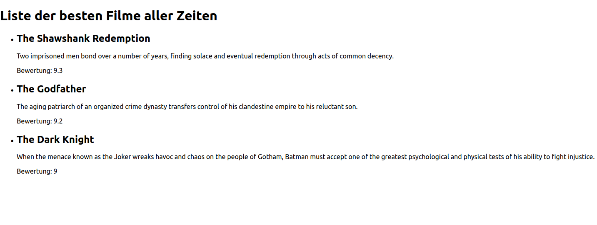

# SPA-react-movielist

## Filmliste

Szenario: Du hast eine App, die eine Liste von Filmen anzeigt. Jeder Film hat einen Titel, eine Beschreibung und eine Bewertung. 
Du möchtest die Liste mithilfe von React rendern.

Task-Liste:
- Erstelle ein neues Projekt mittels `create-react-app` oder `npm create vite@latest`
- Erstelle im components Ordner eine funktionale Komponente "FilmListe"
- Erstelle in dieser component ein Array von Film-Objekten mit Titel, Beschreibung und Bewertung
- Verwende das Array, um eine Liste (li) von den Filmen mit Hilfe von JSX zu rendern
- Füge den Filmen einen Key hinzu, um React zu helfen, Änderungen korrekt zu identifizieren
 - hierzu könntest du eine random id erzeugen. Oder du nimmst den index aus der map-schleife. Oder nimm einfach den Filmtitel
- Gib die Liste in der Komponente "App" aus

Beispielhafter Code-Anfang (FilmListe Component):

```jsx
import React from 'react';

function FilmListe() {
  const filme = [
    { titel: 'The Shawshank Redemption', beschreibung: 'Two imprisoned men bond over a number of years, finding solace and eventual redemption through acts of common decency.', bewertung: 9.3 },
    { titel: 'The Godfather', beschreibung: 'The aging patriarch of an organized crime dynasty transfers control of his clandestine empire to his reluctant son.', bewertung: 9.2 },
    { titel: 'The Dark Knight', beschreibung: 'When the menace known as the Joker wreaks havoc and chaos on the people of Gotham, Batman must accept one of the greatest psychological and physical tests of his ability to fight injustice.', bewertung: 9.0 },
  ];

//...

```
### BONUS (bitte versuchen):
Füge das Array mit den Filmen in die Component App.js hinzu und übergebe es als props an die FilmListe Component.

### Ergebnis
So könnte die Website aussehen:

