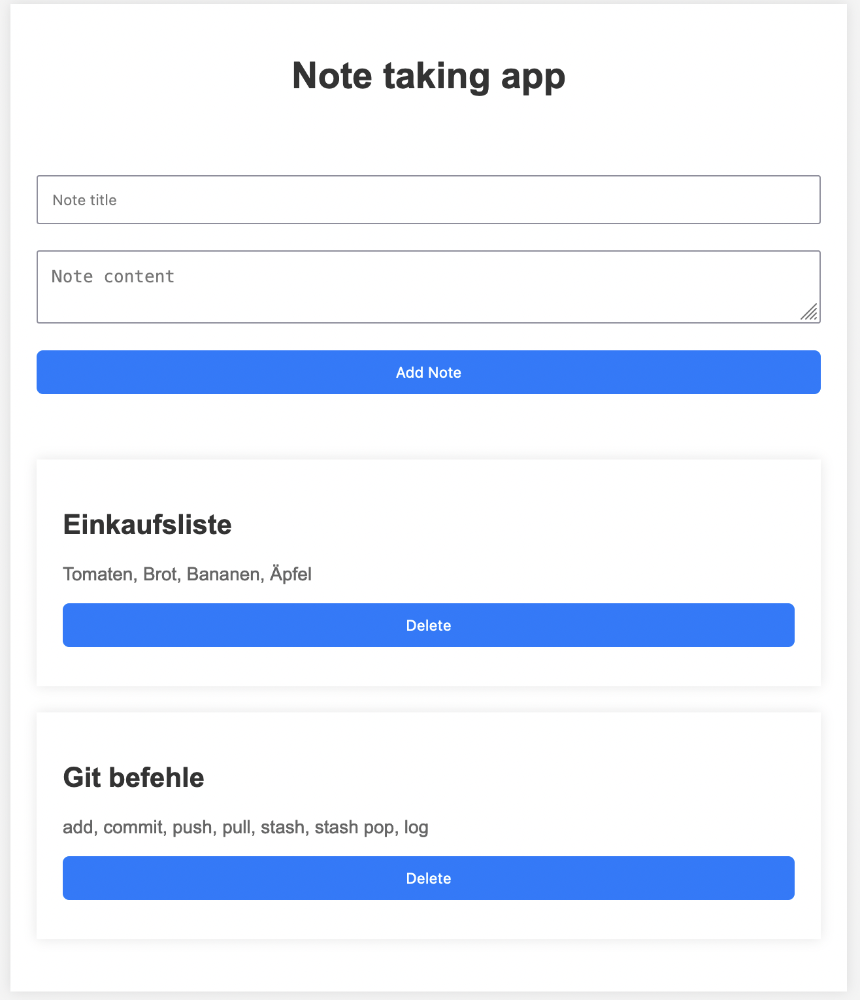

## Notizapp

Baue eine kleine App mit der man Notizen erstellen und löschen kann, die im Globalen Context gespeichert werden. 
Vervollständige dazu den Code in den einzelnen Dateien im /src Ordner. Am Ende soll es so aussehen.

