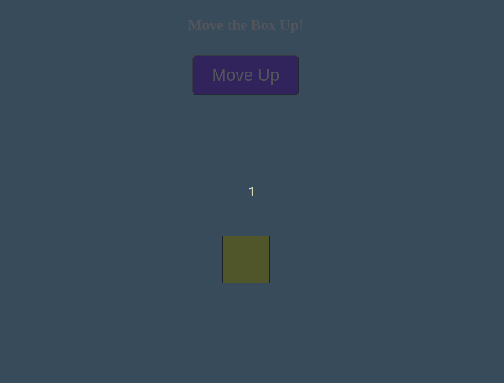

# 2. [Move a Box Up](https://malcoded.com/posts/react-component-style/)

Before you start

- Navigate to the directory `task-02` in your terminal
- Install dependencies with `npm install`

## Instructions

The goal of this task is to move the box upwards when the button is clicked.

The requirements are:

- Use state to hold the value of the transformation points
- Create an event handler which will decrement the transformation points when the button is clicked
- Use the transformation points value with inline CSS to move the box upwards

## What the final application looks like

> Hint: use inline style
>
> `translateY(${transformationPoints}px)`
