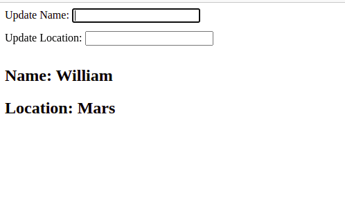

# 4. [Use React Context](https://kentcdodds.com/blog/how-to-use-react-context-effectively)

Before you start

- Navigate to the directory `task-04` in your terminal
- Install dependencies with `npm install`

## Instructions

You are required to create user data containing name and location in a context, pass this data to two individual components, and update the data from a separate component.

One component should be in charge of rendering the name, another component should be in charge of rendering the location, and the third component should have two inputs to update the name and the location.

The requirements are:

- Create a React context with name and location data
- Wrap parent component with context.
- Retrieve data in different components.
- Update data through inputs in a different component.

## What the final application looks like

