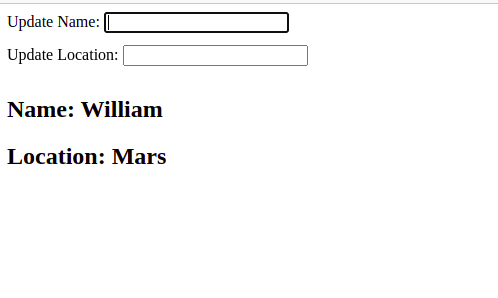

# 4. [React Context verwenden](https://kentcdodds.com/blog/how-to-use-react-context-effectively)

Bevor du beginnst

- Navigiere in deinem Terminal zum Verzeichnis `task-04`.
- Installiere die Abhängigkeiten mit `npm install`

## Anleitung

Du musst Benutzerdaten mit Namen und Standort in Context erstellen, diese Daten an zwei einzelne Komponenten weitergeben und die Daten von einer separaten Komponente aus aktualisieren.

Eine Komponente sollte für die Darstellung des Namens zuständig sein, eine andere Komponente für die Darstellung des Ortes und die dritte Komponente sollte zwei Inputfelder haben, um den Namen und den Ort zu aktualisieren.

Die Anforderungen sind:

- Erstelle einen React-Context mit Namen- und Standortdaten
- Umhülle die übergeordnete Komponente mit dem Kontext.
- Rufe Daten in verschiedenen Komponenten ab.
- Aktualisiere Daten durch Eingaben in einer anderen Komponente.

## So sieht die fertige Anwendung aus

